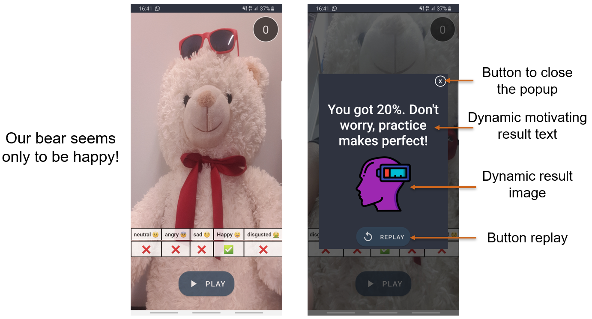

# Multimedia_Project

  

  

This App contains 3 applets:

# Sign it:
This one allows you to translate voice to sign language. With a database of more than 10k words and expressions, this applet is a nice tool and it also may be used to learn sign language.

This is how the UI looks like:

  

If you click on a word, you can view the different meanings and select the suitable one.

  

  

The implementation of this applet is simplified here:

  

# Express it:
With this one you can practice face expressions. You will recieve 5 random emotions as tasks and you have to try to do them with your face.

This is how the UI looks like:

  

After finishing the tasks, you will get the final results.

  

The implementation of this applet is simplified here:

  

# Quote it:
This one allows you to quote your face picture according to 6 different modes: Emotion, Face Age, Hair, Makeup, Head Pose and Accessories. 

This is how the UI looks like:

  

The implementation of this applet is simplified here:

  

